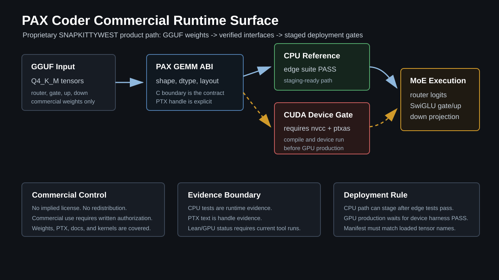
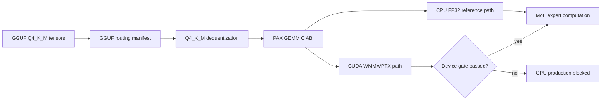
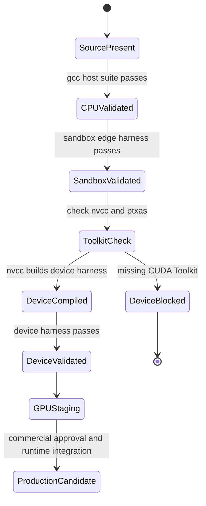
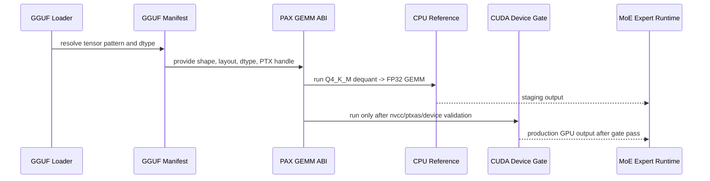

# PAX Coder Commercial Integration README

PAX Coder is the commercial engineering surface for the Sovereign CUDA Kernels
GEMM bridge: GGUF Q4_K_M model tensors enter through a constrained C ABI,
execute through a CPU reference path today, and move to CUDA/WMMA/PTX only after
the post-toolkit device validation gate passes.

This document is written for implementers, commercial integrators, and auditors
who need to understand exactly what is production-ready, what is staging-ready,
and what still requires hardware/toolchain validation.



## License and Commercial Use

This repository is governed by the local `LICENSE` file and the proprietary
commercial license language in `README.md`.

Operational summary:

- Copyright is held by Jessica / SNAPKITTYWEST / SnapKitty.
- The repository describes proprietary and confidential software, kernels,
  assembly listings, PTX files, documentation, and associated materials.
- The local license states that no permissions are granted by visibility,
  cloning, downloading, starring, or possession.
- Commercial use requires direct authorization from the copyright holder.
- Model weights, checkpoints, PTX files, kernel source, documentation, and
  runtime integration surfaces must be treated as covered proprietary material.
- Third-party components remain under their own licenses where explicitly
  identified; this does not expand rights to the proprietary material.

This README is not a license grant. It is product and integration documentation
for authorized SNAPKITTYWEST commercial deployments.

## Current Evidence Boundary

| Layer | Current status | Evidence in this checkout |
| --- | --- | --- |
| C ABI | Implemented | `kernels/gemm/sovereign_pax_gemm.h` |
| GGUF Q4_K_M CPU path | Tested | `kernels/tests/test_sovereign_pax_gemm_ref.c` |
| Sandbox edge scenarios | Tested | `kernels/tests/test_sovereign_pax_gemm_gpu_harness.cu` compiled as C sandbox harness |
| CUDA f32 launcher | Source-ready | `kernels/gemm/sovereign_pax_gemm.cu` |
| CUDA WMMA launcher | Source-ready | `kernels/gemm/sovereign_pax_gemm.cu` |
| Production device harness | Created | `kernels/tests/test_sovereign_pax_gemm_gpu_device_harness.cu` |
| PTX handle | Registered | `kernels/gemm/sovereign_pax_gemm_sm86.ptx:sovereign_pax_gemm_m16n8k16_sm86` |
| PTX assembly | Blocked here | `ptxas` is not available on PATH |
| CUDA device execution | Blocked here | `nvcc` is not available on PATH |
| Lean proof status | Not certified here | Requires current Lean build and sorry/axiom scan |

Do not convert "source-ready" into "production-deployed" without a passing
toolchain and device run.

## Architecture



The commercial product line is intentionally staged:

1. The CPU reference path establishes the numerical and ABI contract.
2. The sandbox harness preserves edge-case construction without requiring CUDA.
3. The device harness is the production GPU gate after CUDA Toolkit install.
4. The GGUF manifest binds tensor names, shapes, dtypes, and runtime path.
5. PTX is referenced by exact handle, not by a vague CUDA context claim.

## Files

| File | Purpose |
| --- | --- |
| `kernels/gemm/sovereign_pax_gemm.h` | Public C ABI for PAX GEMM calls, dtypes, layouts, shapes, and CUDA launchers |
| `kernels/gemm/sovereign_pax_gemm_ref.c` | CPU reference implementation for FP32 GEMM and GGUF Q4_K_M dequantized GEMM |
| `kernels/gemm/sovereign_pax_gemm.cu` | CUDA f32 reference launcher and WMMA f16 input / f32 accumulator launcher |
| `kernels/gemm/sovereign_pax_gemm_sm86.ptx` | sm_86 PTX handle artifact with `mma.sync` entry text |
| `kernels/gemm/sovereign_pax_gemm.gguf.json` | GGUF tensor routing manifest for MoE router, gate, up, and down projections |
| `kernels/tests/test_sovereign_pax_gemm_ref.c` | CPU production edge suite for GGUF Q4_K_M -> GEMM |
| `kernels/tests/test_sovereign_pax_gemm_gpu_harness.cu` | Sandbox GPU-scenario edge harness; not device evidence |
| `kernels/tests/test_sovereign_pax_gemm_gpu_device_harness.cu` | Real post-toolkit CUDA device validation harness |
| `PAX_PROOF_OF_WORK.md` | Evidence-bound deployment gate |
| `PAX_LEAN_LINKING.md` | Linkage map between intended proof surfaces and implementation surfaces |
| `INTEGRATION_COMPLETE.md` | Integration handoff document with current evidence note |

## GGUF Runtime Contract

The manifest binds the product path:

```text
GGUF tensor
Q4_K_M dequantization
logical FP32 tensor
PAX GEMM ABI
CPU reference or validated CUDA device launcher
MoE expert computation
```

Expected tensor patterns:

| Tensor pattern | Logical shape | Runtime role |
| --- | --- | --- |
| `moe.router.W_gate` | `[512, 8]` | Router logits |
| `moe.experts.*.W_gate` | `[512, 2048]` | SwiGLU gate projection |
| `moe.experts.*.W_up` | `[512, 2048]` | SwiGLU up projection |
| `moe.experts.*.W_down` | `[2048, 512]` | Expert down projection |

The current Q4_K_M block ABI stores 32 logical 4-bit values per block:

```c
typedef struct sovereign_pax_q4km_block {
    float scale;
    int8_t zero;
    uint8_t qs[16];
} sovereign_pax_q4km_block_t;
```

Dequantized value:

```text
value = scale * (q - zero)
```

## ABI

The integration boundary is C-compatible:

```c
void sovereign_pax_gemm_f32_ref_cpu(
    const float *a,
    const float *b,
    const float *bias,
    float *c,
    sovereign_pax_gemm_shape_t shape,
    float alpha,
    float beta
);

void sovereign_pax_q4km_gemm_f32_ref_cpu(
    const float *a,
    const sovereign_pax_q4km_block_t *b_q4,
    const float *bias,
    float *c,
    sovereign_pax_gemm_shape_t shape,
    float alpha,
    float beta
);
```

CUDA launchers are declared through the same header, but they are only
production evidence after a successful CUDA Toolkit build and device run:

```c
int sovereign_pax_gemm_launch_f32_ref(
    const float *a_dev,
    const float *b_dev,
    const float *bias_dev,
    float *c_dev,
    sovereign_pax_gemm_shape_t shape,
    float alpha,
    float beta
);

int sovereign_pax_gemm_launch_wmma_f16_accum_f32(
    const void *a_f16_dev,
    const void *b_f16_dev,
    const float *bias_dev,
    float *c_dev,
    sovereign_pax_gemm_shape_t shape
);
```

## Validation Flow



Available host validation on this machine:

```powershell
& 'C:\Strawberry\c\bin\gcc.exe' -std=c11 -Wall -Wextra -Werror -Ikernels\gemm kernels\gemm\sovereign_pax_gemm_ref.c kernels\tests\test_sovereign_pax_gemm_ref.c -lm -o C:\tmp\sov_pax_gemm_ref_test.exe
& 'C:\tmp\sov_pax_gemm_ref_test.exe'
```

Sandbox edge harness:

```powershell
& 'C:\Strawberry\c\bin\gcc.exe' -x c -std=c11 -Wall -Wextra -Werror -Ikernels\gemm kernels\gemm\sovereign_pax_gemm_ref.c kernels\tests\test_sovereign_pax_gemm_gpu_harness.cu -lm -o C:\tmp\sov_pax_gemm_gpu_sandbox_harness.exe
& 'C:\tmp\sov_pax_gemm_gpu_sandbox_harness.exe'
```

Post-toolkit production device gate:

```powershell
nvcc -arch=sm_86 -O2 -std=c++14 -I kernels\gemm kernels\gemm\sovereign_pax_gemm.cu kernels\gemm\sovereign_pax_gemm_ref.c kernels\tests\test_sovereign_pax_gemm_gpu_device_harness.cu -o C:\tmp\sov_pax_gemm_gpu_device_harness.exe
& 'C:\tmp\sov_pax_gemm_gpu_device_harness.exe'
ptxas --version
```

## Production Edge Cases

The current edge suite covers:

| Case | Layer | Why it matters |
| --- | --- | --- |
| Q4 low/high nibble decode | CPU reference | Prevents half-byte packing regressions |
| Q4 logical index 31/32 boundary | CPU reference | Catches block rollover errors |
| Partial final Q4 block | CPU reference | Supports non-32-multiple tensor lengths |
| Null and invalid shape no-op | CPU reference | Preserves safe failure behavior |
| Scalar bias/alpha/beta | CPU and sandbox | Catches epilogue ordering mistakes |
| Ragged padded dimensions | CPU and sandbox | Verifies `lda`, `ldb`, `ldc` handling |
| MoE router shape | CPU and sandbox | Validates `[512,8]` route |
| MoE expert gate/up shape | CPU and sandbox | Validates `[512,2048]` expert expansion |
| MoE expert down shape | CPU and sandbox | Validates `[2048,512]` projection |
| PTX handle contract | CPU reference | Keeps launch authority bound to exact symbol |
| WMMA dimension rejection | Device harness | Ensures unsupported tensor-core shapes fail closed |

## Mermaid Runtime Sequence



## Commercial Deployment Checklist

Pre-deploy:

- Confirm written commercial authorization covers the deployment.
- Confirm the target environment is a SNAPKITTYWEST-authorized deployment.
- Confirm weights and GGUF files are not redistributed outside the license scope.
- Confirm `PAX_PROOF_OF_WORK.md` matches the actual validation run.
- Confirm CPU reference suite passes from a clean command shell.
- Confirm sandbox harness is not reported as device evidence.
- Confirm `nvcc`, `ptxas`, and target GPU are available before GPU deployment.
- Confirm the PTX handle in C code matches the manifest and loaded module.

Deploy:

- Stage the CPU path first.
- Load representative GGUF tensors matching the manifest names and shapes.
- Compare MoE expert outputs against the CPU reference.
- Compile the CUDA device harness after Toolkit install.
- Run the CUDA device harness on the target card.
- Promote GPU execution only after device output is within tolerance.

Rollback triggers:

- Any host suite failure.
- Any nonzero unexpected max error above the documented tolerance.
- Any tensor name, shape, dtype, or layout mismatch.
- Any PTX handle mismatch.
- Any CUDA launch returning `SOV_PAX_GEMM_BAD_ARGUMENT`,
  `SOV_PAX_GEMM_UNSUPPORTED`, or `SOV_PAX_GEMM_CUDA_ERROR` in a supported case.
- Any deployment attempt without matching commercial authorization.

## Evidence Rules

Use precise language:

- "CPU reference tested" means the host C suite passed.
- "Sandbox edge harness passed" means edge-case scaffolding ran without CUDA.
- "PTX handle registered" means the handle string and PTX entry text are present.
- "CUDA source-ready" means code exists for Toolkit compilation.
- "GPU device validated" requires a real `nvcc` build and device harness run.
- "Lean proven" requires a current Lean build and proof-placeholder scan.

Do not use:

- "GPU compiled" unless `nvcc` compiled it in the current environment.
- "PTX assembled" unless `ptxas` or the CUDA driver loaded it successfully.
- "Production-sufficient proof" unless the proof build and remaining placeholders
  are documented.
- "Open source" for this repository unless the license is explicitly changed.

## PAX Coder Product Position

PAX Coder is a commercial integration product, not a loose sample repository.
The value is the controlled bridge between:

- proprietary GGUF tensor routing,
- audited C ABI boundaries,
- reproducible CPU reference behavior,
- explicit PTX kernel handles,
- CUDA deployment gates,
- and evidence-bound proof linkage.

The intended commercial posture is disciplined: fast integration for authorized
users, strict provenance for auditors, and no expansion of rights by possession.

## Support Handoff

When handing this to another agent or engineer, include:

1. The exact Git working tree status.
2. The compile and run output for the CPU suite.
3. The compile and run output for the sandbox harness.
4. Whether `nvcc` and `ptxas` are available.
5. The exact GPU model and target architecture.
6. Whether GGUF test weights were real, synthetic, or absent.
7. Whether Lean proofs were actually built in that session.

If any item is missing, label it missing. Do not fill gaps with inferred status.
