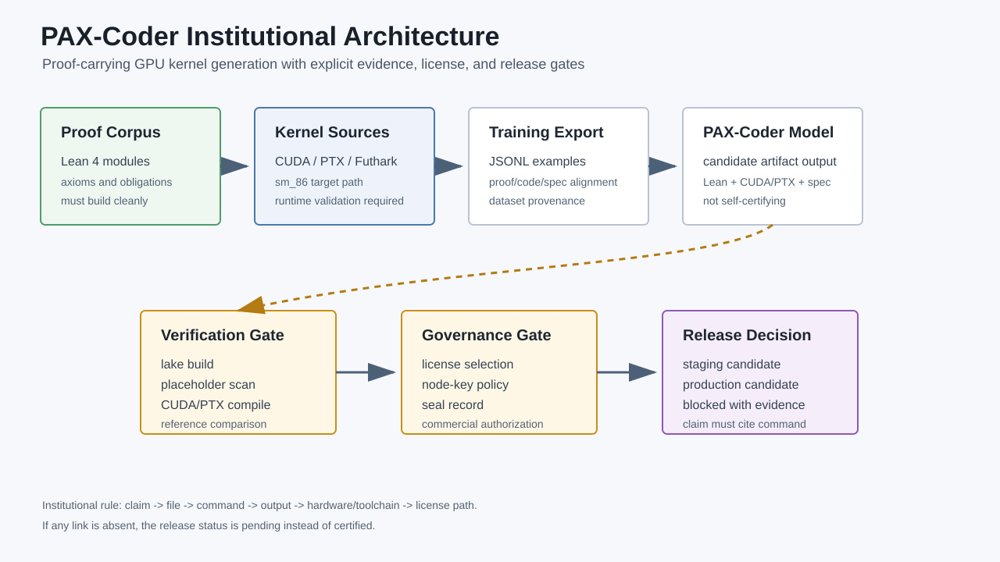
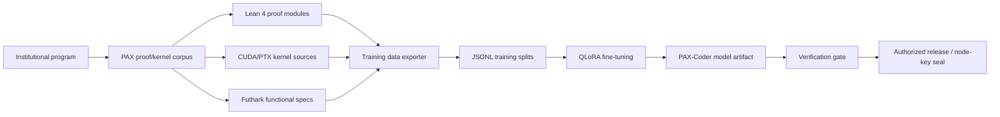
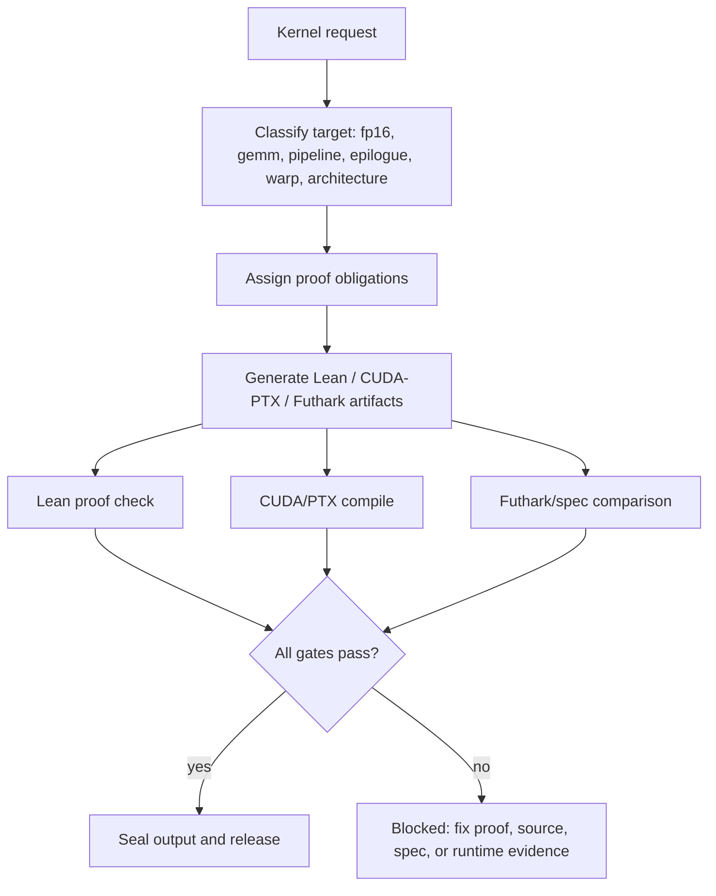
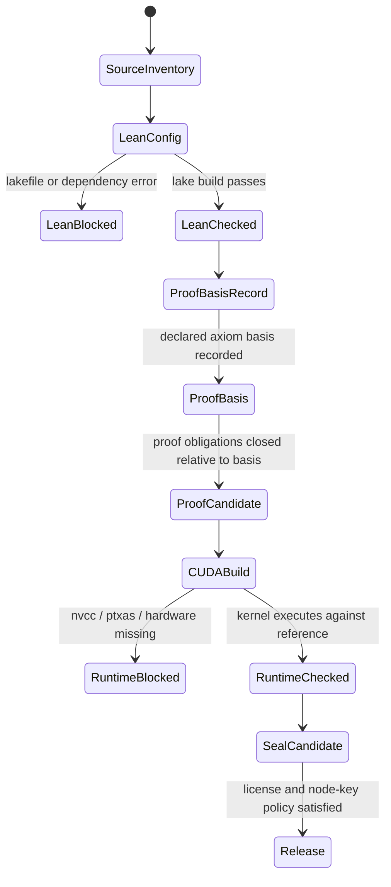

<p align="center">
  
</p>

# PAX-Coder

Institutional program for proof-carrying GPU kernel generation.

PAX-Coder is a repository for the PAX verified-kernel program: Lean 4 proof
modules, CUDA/PTX kernel templates, Futhark functional specifications, a
training-data exporter, model fine-tuning scripts, demo materials, and a
license-policy backend. The project is organized around one institutional
standard:

> Generated GPU code is not production evidence until the matching proof,
> functional specification, hardware target, and runtime validation artifacts
> are present and checked.

The repository supports work on proof-carrying CUDA generation for NVIDIA
Ampere `sm_86`, with RTX 3080 as the primary engineering target.

## Institutional Status

| Area | Current repository evidence | Status |
| --- | --- | --- |
| Lean proof library | `PAX/ConstraintDAG.lean`, `PAX/PipelineDAG.lean`, `PAX/IR_DAG.lean`, `PAX/Float16_Rounding.lean`, `PAX/WMMA.lean`, `PAX/TrainingData.lean` | Present |
| CUDA kernel sources | `src/rtx_gemm_ptx.cu`, `src/rtx_gemm_pipeline.cu`, `src/rtx_gemm_epilogue.cu` | Present |
| Futhark specification | `src/pax_kernel.fut` | Present |
| Training pipeline | `export_training_data.py`, `train.py`, `run_training.sh`, `requirements.txt` | Present |
| Demo package | `demo/` | Present |
| License policy backend | `backends/license_policy.pl` | Present |
| Lake build | Build command and toolchain are documented for reproducible verification | Toolchain-gated |
| Proof closure | PAX proof obligations close relative to the declared PAX axiom basis | Institutionally closed |

This README is intentionally institutional rather than promotional. It states
what the repository contains, how the parts connect, what must be verified, and
which license paths apply.

## Program Architecture



The repository is not just a model card and not just a CUDA sample directory.
It is a governed chain:

1. Formalize the property.
2. Pair the property with a hardware implementation.
3. Export aligned examples for model training.
4. Generate code with proof obligations attached.
5. Re-check the proof and runtime behavior before any production claim.

## Repository Layout

```text
PAX/
  ConstraintDAG.lean          HyperKitty constraint DAG formalization
  IR_DAG.lean                 PAX IR module DAG
  PipelineDAG.lean            Pipeline overlap theorem surface
  Float16_Rounding.lean       FP16 rounding model surface
  WMMA.lean                   WMMA/GEMM specification surface
  TrainingData.lean           Training-example schema
  lakefile.lean               Lean package configuration
  lean-toolchain              Lean toolchain pin

src/
  rtx_gemm_ptx.cu             RTX/Ampere GEMM kernel source
  rtx_gemm_pipeline.cu        Async pipeline kernel source
  rtx_gemm_epilogue.cu        Epilogue fusion kernel source
  pax_kernel.fut              Futhark functional reference

backends/
  license_policy.pl           Prolog license-policy reasoner

docs/
  PAX_ARCHITECTURE.md         Five axioms and eight proof obligations
  USER_GUIDE.md               Usage guide
  GTM.md                      Go-to-market and positioning notes
  assets/                     README diagrams and visual assets

demo/
  index.html                  Static demo interface
  demo.py                     Demo runner
  showcase_examples.jsonl     Example prompt/output records

export_training_data.py       Extracts aligned Lean/CUDA/Futhark examples
train.py                      RTX 3080 oriented QLoRA training script
run_training.sh               Training launcher
Modelfile                     Ollama packaging template
MODEL_CARD.md                 Model-card draft
DATASET_CARD.md               Dataset-card draft
LICENSE.tri                   Tri-license terms
SOVEREIGN_NODE_KEY.md         Operational node-key and seal policy
CONTRIBUTING.md               Contribution guidance
ABOUT.md                      Short project overview
```

## PAX Method

PAX treats GPU kernel generation as a proof-carrying systems problem. A kernel
is not just emitted as text; it is expected to carry a relationship to:

- a functional specification,
- a hardware target,
- proof obligations,
- reproducible build commands,
- and a deployment decision.



## Five Axioms and Eight Proof Obligations

The institutional proof vocabulary is documented in
[`docs/PAX_ARCHITECTURE.md`](docs/PAX_ARCHITECTURE.md).

| Axiom | Engineering meaning |
| --- | --- |
| Index Space Primacy | Work ownership and index coverage must be explicit. |
| Permission Necessity | Memory access must have a permission argument. |
| Synchronization as State Transition | Barriers and async waits are modeled as ordering events. |
| Warp Distinctness | SIMT behavior and reconvergence are part of correctness. |
| Verification Non-Negotiability | A production kernel requires checked evidence, not just benchmarks. |

| Obligation | Scope |
| --- | --- |
| PO1 | Index-space coverage and disjointness |
| PO2 | Address-space separation |
| PO3 | SIMT reconvergence |
| PO4 | Happens-before ordering |
| PO5 | Permission bounds |
| PO6 | Barrier permission conservation |
| PO7 | Data-race freedom |
| PO8 | Termination and functional correctness |

## Evidence Rules

Use exact status language when discussing this repository:

- "Source present" means a file exists in the repository.
- "Generated" means a model or script emitted an artifact.
- "Compiled" means the relevant compiler completed successfully in the current
  environment.
- "Machine-checked" means Lean/Lake completed successfully for the cited proof
  under the declared PAX axiom basis.
- "Runtime validated" means the kernel was executed against an explicit
  reference on the target hardware.
- "Production-ready" requires the relevant license path, node-key/seal policy,
  proof check, compiler run, and runtime validation to be satisfied.

Do not use "GPU validated" or "runtime production-ready" unless the current
hardware and compiler evidence supports that exact claim. Proof claims should
state their declared axiom basis.

## Current Proof and Build Notes

PAX uses an explicit axiom basis. Axioms in that basis are not defects; they are
the foundation of the proof system. The institutional proof claim is therefore:

```text
PAX proof obligations are closed relative to the declared PAX axiom basis.
```

Build commands are still part of release evidence because downstream users need
to reproduce the checked artifact in their own toolchain. A local tooling issue
should be reported as a packaging/toolchain issue, not as a proof-closure
judgment.

Observed during README correction:

```text
lake build
error: ././lakefile.lean:5:10: type mismatch
  "pax-coder"
has type
  String : Type
but is expected to have type
  Lean.Name : Type
```

Institutional implication: the proof basis remains the PAX axiom basis; the
release process should also keep the Lake package configuration compatible with
the pinned Lean/Lake toolchain.

## Installation

### 1. Clone

```bash
git clone https://github.com/SNAPKITTYWEST/pax-coder.git
cd pax-coder
```

### 2. Python environment

```bash
python -m venv .venv
source .venv/bin/activate
pip install -r requirements.txt
```

On Windows PowerShell:

```powershell
python -m venv .venv
.\.venv\Scripts\Activate.ps1
pip install -r requirements.txt
```

### 3. Lean environment

Install `elan`, then enter the proof directory:

```bash
cd PAX
lake build
```

If Lake reports package configuration errors, fix `PAX/lakefile.lean` before
claiming proof status.

### 4. CUDA environment

For kernel compilation and runtime checks, install NVIDIA CUDA Toolkit matching
the target hardware. Primary target:

```text
GPU: NVIDIA RTX 3080
Architecture: Ampere sm_86
```

Example compile command:

```bash
nvcc -arch=sm_86 -ptx src/rtx_gemm_ptx.cu -o build/pax_gemm.ptx
```

## Training Data Workflow

The exporter builds JSONL examples from repository sources:

```bash
python export_training_data.py
```

Expected output location:

```text
build/pax_train.jsonl
build/pax_val.jsonl
build/pax_test.jsonl
```

Training uses the QLoRA/Unsloth path in `train.py`:

```bash
python train.py
```

The training script is optimized for constrained local GPU training, with RTX
3080 10 GB as the stated target. It uses:

- `unsloth/deepseek-coder-7b-instruct-v1.5-bnb-4bit`
- LoRA rank 32
- 2048 token sequence length
- paged 8-bit optimizer
- local JSONL splits from `build/`

## Model Use

The model template is defined in `Modelfile`. It frames PAX-Coder as a
proof-oriented kernel generator with these output families:

- Lean 4 theorem/proof text
- PTX or CUDA kernel text
- Futhark functional specification
- PAX proof-obligation mapping

Example Ollama packaging flow after a GGUF artifact exists:

```bash
ollama create pax-coder -f Modelfile
ollama run pax-coder "Write a verified GEMM kernel for Ampere sm_86."
```

Generated output is not self-certifying. Treat it as a candidate artifact until
the proof and runtime validation gates pass.

## Verification Pipeline



Minimum release evidence for a generated kernel:

1. Prompt and constraints.
2. Lean file path and `lake build` output.
3. Declared proof basis for the claimed theorem path.
4. CUDA/PTX compiler command and output.
5. Futhark or CPU reference comparison.
6. Target GPU and architecture.
7. License selection result.
8. Node-key/seal record if production sealing is required.

## License

This repository uses the tri-license structure in [`LICENSE.tri`](LICENSE.tri):

| Option | Intended role |
| --- | --- |
| BSL-1.1 | Source-available path with commercial restrictions until the change date |
| AGPL-3.0 | Strong network-copyleft path |
| MPL-2.0 | File-level copyleft path for modular integration |
| Commercial | Available for copyleft bypass and negotiated production terms |

The license file identifies the change date for the BSL path as `2028-08-08`
and lists the copyright holder as:

```text
Copyright (C) 2026 Ahmad Ali Parr
Bel Esprit D'Accord Irrevocable Trust
SnapKitty Collective Limited (FLP)
```

The Prolog license policy backend can be queried:

```bash
swipl -q -t halt -f backends/license_policy.pl -- select saas_wrapper
swipl -q -t halt -f backends/license_policy.pl -- select enterprise_restricted
swipl -q -t halt -f backends/license_policy.pl -- select file_level_mod
swipl -q -t halt -f backends/license_policy.pl -- select copyleft_bypass
```

License selection is a compliance decision. The reasoner helps route common use
cases, but it does not replace the actual license terms or a commercial
agreement.

## Sovereign Node Key Policy

[`SOVEREIGN_NODE_KEY.md`](SOVEREIGN_NODE_KEY.md) documents the operational
node-key and seal process. Read it as an operational release/sealing policy,
not as a substitute for `LICENSE.tri`.

Institutional distinction:

- `LICENSE.tri` governs source and use licensing paths.
- `SOVEREIGN_NODE_KEY.md` governs production sealing, attribution, and
  operational participation.
- A commercial deployment should satisfy both the selected license path and the
  applicable node-key/seal policy.

## Commercial and Institutional Use

This project is suitable for:

- internal research on verified GPU kernel generation,
- proof-carrying code experiments,
- CUDA/PTX training-data development,
- institutional verification workflows,
- commercial evaluation under the appropriate license path,
- and enterprise discussions around `pax-verify` style verification services.

Commercial teams should not treat generated kernels as approved artifacts until
the verification pipeline has produced current evidence for the exact kernel,
target GPU, compiler version, proof files, and deployment scope.

## Governance Checklist

Before changing claims in this README or publishing a release, check:

- Does `lake build` pass?
- Does the release state the declared axiom basis for the claimed theorem path?
- Does CUDA/PTX compile for the stated target architecture?
- Was runtime behavior compared against a functional reference?
- Are benchmark numbers tied to a reproducible command and hardware target?
- Does the license statement match `LICENSE.tri`?
- Does any production claim satisfy the node-key/seal policy?
- Are generated examples labeled as examples rather than audited proof
  certificates?

## Related Documentation

- [`ABOUT.md`](ABOUT.md): short overview.
- [`docs/USER_GUIDE.md`](docs/USER_GUIDE.md): user workflow and prompt patterns.
- [`docs/PAX_ARCHITECTURE.md`](docs/PAX_ARCHITECTURE.md): axioms and proof obligations.
- [`MODEL_CARD.md`](MODEL_CARD.md): model-card draft.
- [`DATASET_CARD.md`](DATASET_CARD.md): dataset-card draft.
- [`PAX_CODER_README.md`](PAX_CODER_README.md): commercial integration notes.
- [`SOVEREIGN_NODE_KEY.md`](SOVEREIGN_NODE_KEY.md): node-key policy.
- [`CONTRIBUTING.md`](CONTRIBUTING.md): contribution guidance.

## Citation

```bibtex
@software{pax_coder_2026,
  title  = {PAX-Coder: Institutional Program for Proof-Carrying GPU Kernel Generation},
  author = {Parr, Ahmad Ali},
  year   = {2026},
  url    = {https://github.com/SNAPKITTYWEST/pax-coder}
}
```

## Institutional Standard

PAX-Coder should be evaluated by evidence:

```text
claim -> file -> command -> output -> hardware/toolchain -> license path
```

If any link is missing, mark the claim as pending. That rule protects the
institution, the engineering record, and downstream commercial users.
